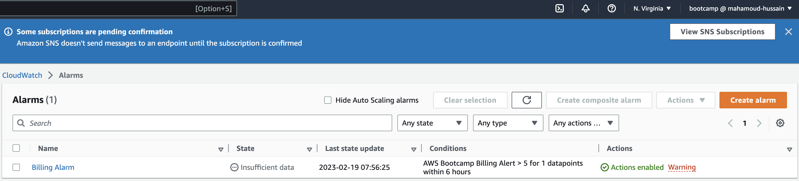

# Week 0 — Billing and Architecture

## Install and verfiy AWS CLI

## create a Budget Alarm

cloudwatch Alarm

## logical diagram

this is the link to my logical diagram.

https://lucid.app/lucidchart/98d76881-7911-47f3-9cb5-a6e474d61f9d/edit?viewport_loc=-340%2C-79%2C2325%2C1367%2C0_0&invitationId=inv_a3ed4d93-a871-48c8-9d74-e42a74669723
